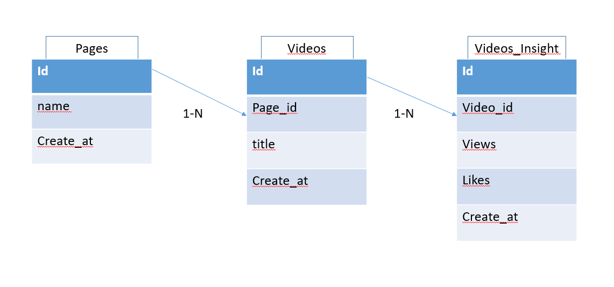

## Test technique de Brut

La construction de la base se fait via le script db.py (fait via sqlalchemy)
Les API sont dans la feuille API
et les test sont dans le main

Pour utiliser les API, il faudra se connecter en localhost en activant l'environnement dans
env/Script/activate

Suivre les instructions : https://www.osradar.com/how-to-install-flask-in-windows-10/ Pour créer son serveur en localhost

et enfin faire un flask run pour lancer le serveur en localhost.

Pour tester les api, il faudra sur une autre console launch le main.py

## Schema de la base 

